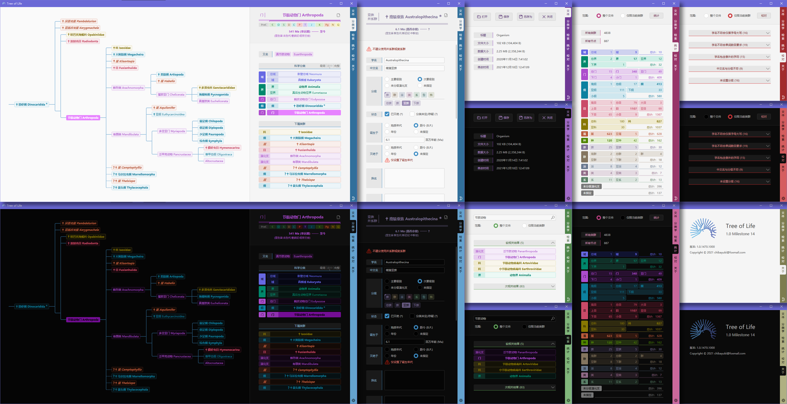

# Tree of Life
基于现代分类学的生物演化树编辑程序。

## 技术要点
* 树数据结构的增删改查及其序列化/反序列化
* 文件封装与版本控制
* 语义分析与模糊搜索
* 树操作、搜索以及序列化/反序列化的性能优化

## 里程碑
* Milestone 1 (版本 1.0.16.1000.M1.201110-2050, 未发布)
> 初步定义类群、演化树等概念的数据结构，后端实现类群的增删改查等基本功能。
* Milestone 2	(版本 1.0.112.1000.M2.201110-2050)
> UI封装表示类群、上下级类群组的控件。
* Milestone 3	(版本 1.0.209.1000.M3.201119-1900, 未发布)
> 后端实现基于Json的文件打开、保存等功能。
* Milestone 4	(版本 1.0.323.1000.M4.201128-1700)
> UI封装用于选择分类级别的多级动态控件，实现类群的查看、跳转、基本信息编辑功能。
* Milestone 5	(版本 1.0.415.1000.M5.201204-2200)
> 文件格式变更为易于版本兼容的容器式结构，UI实现类群的继承变更、排序、删除等功能，新增临时的纯文本演化树。
* Milestone 6	(版本 1.0.617.1000.M6.201226-1000)
> 移植到.NET 5和WPF，将文件、版本等抽象为包、包内容等数据结构，“文件”页面增加文件信息。
* Milestone 7	(版本 1.0.708.1000.M7.201230-2100)
> 实现基本的搜索功能和UI。
* Milestone 8	(版本 1.0.812.1000.M8.210108-2100)
> 实现模糊搜索功能，纯文本演化树改为只显示当前类群附近的部分，选择类群和编辑类群时将同步更新演化树，编辑类群分级时将自动更新中文名。
* Milestone 9	(正在开发)
> 版本控制策略首次得到验证，即将支持并系群与复系群。

#### 说明
###### 1、Tree of Life使用了.NET5版本Com的部分特性（例如Com.Chromatics命名空间），但该版本正在初期重构阶段，尚未开源，如有运行/调试需求，请自行解决。
###### 2、截图所示的生物分类数据主要来自维基百科，数据文件尚未开源。
###### 3、如有合作意向，需要未开源可执行文件、数据文件的，请联系本人。

